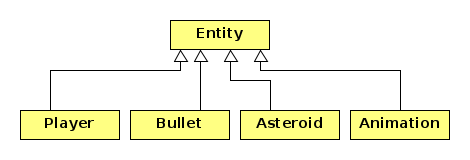

# Asteroids

U ovom je zadatku  potrebno završiti igru **Asteroids**. Polazimo od 
prethodnog repozitorija **vj-sfml2** u kojem smo kreirali dijelove igre.
Taj kod treba prekopirati u ovaj repozitorij, zajedno sa svim datotekama 
sustava za izgradnju, i završiti kodiranje igre.

Klase svih entiteta u igri su nam već poznate.

Klasa `Asteroid` predstavlja asteroid koji se giba slučajno odabranom brzinom i rotira 
određenom kutnom brzinom. Gibanje se vrši po torusu, odnosno kada asteroid izađe iz prozora 
kroz jednu stranicu vraća se u prozor kroz suprotnu stranicu na istoj koordinati. 
U početnom se trenutku 6 asteroida (2 velika, 2 srednja i 2 mala) pojavljuju na slučajno 
odabranim koordinatama unutar prozora i započinju svoje gibanje slučajnim brzinama. 
Asteroidi dobivaju i određenu rotaciju.

Klasa `Player` predstavlja svemirski brod koji se u početnom trenutku nalazi u centru prozora.
On reagira na strelice. Lijeva i desna strelica ga rotiraju na lijevo i na desno. Gornja strelica 
ubrzava brod, a donja usporava. Brzine rotacije i ubrzavanje/usporavanje skalirajte prema svom
nahođenju. Svemirski se brod isto tako kreće po torusu. Pritiskom na razmaknicu svemirski brod 
ispaljuje metak (_bullet_) u smjeru svoje osi pred sebe.

Klasa `Bullet` predstavlja metak koji ispucava brod. Metak se kreće brzo i kada napušta ekran 
nestaje. On se ne giba po torusu!

Klasa `Animacija` predstavlja animaciju i ovdje će biti korištena za eksplozije. Najvećim dijelom je 
već napravljena. 

**Pravila igre**. 

- Igrač (svemirski brod) započinje igru sa 3 života. Svaki puta kada ga pogodi asteroid gubi jedan život. Igra je gotova 
  kada izgubi sva tri života. Kad je igrač pogođen vraća se u svoju početnu poziciju (centar prozora) i dobiva svoju
  početnu rotaciju. 

- Igrač puca na asteroide. Kada pogodi veliki asteroid dobiva 10 bodova, za srednji dobiva 20, a za mali 
  40 bodova. Bodovi se naravno zbrajaju. Ako igrač pogodi sve asteroide igra se završava. 

- Asteroid koji je pogođen nestaje iz igre isto kao i metak koji ga je pogodio. 
  Kada je pogođen veliki asteroid nastaju dva mala asteroida 
  koji se započinju gibati proizvoljnim, ali međusobno suprotnim brzinama. Kada se pogodi srednji ili mali 
  asteroid ne nastaju novi asteroidi. 

- Na mjestu gdje metak pogodi asteroid ili asteroid pogodi igrača nastaje eksplozija (animacija eksplozije).

- Broj života i broj bodova se ispisuju na ekranu. 

- Nakon završetka igre moguće je nastaviti sa sljedećom igrom pritisom na razmaknicu. Tada se ponovo 
  igrač stavlja u centar prozora, raspoređuje se 6  asteroida (2 velika, 2 srednja i 2 mala) na slučajnim 
  koordinatama i započinju svoje gibanje  slučajnim brzinama. Iz igre se izlazi pritiskom na 
  "x" prozora. 

**Detekcija kolizija**

Potrebno je detektirati kolizije između metka i asteroida te asteroida i svemirskog broda (igrača). 
Za testiranje treba koristiti najjednostavniju metodu, a to je metoda kružnica. Svakom entitetu treba biti 
pridružena kružnica unutar koje se on nalazi. Entitet pamti radijus te kružnice. Kada se provjerava kolizija
između dva objekta računa se udaljenost njihovih centara koja se uspoređuje sa sumom pripadnih radijusa. 
Ako je udaljenost manja od sume radijusa uzimamo da imamo koliziju i na mjestu kolizije iniciramo eksploziju. 
Nakon kolizije oba objekta u koliziji nestaju. 
Pri tome je važno samo da kolizije izgledaju vizualno prihvatljivo. 

**Napomene**:

- Paziti kod generiranja dva mala asteroida, nakon što je veliki asteroid pogođen, da se ne detektira odmah
  kolizija metka koji je pogodio  veliki asteroid s novonastalim asteroidima. Novi asteroidi se mogu generirati 
  na pozicijama malo razmaknutim od mjesta udara. 

- Igrača možemo spremiti u varijablu članicu `Game` klase jer je stalno prisutan. Svi drugi objekti u igri 
  (asteroidi i meci) nastaju i nestaju. Stoga ih držimo u jednoj listi (`std::list`). Kako ih generiramo 
  dinamički lista će držati objekte tipa `std::unique_ptr<Entity>`. Kada neki element nestaje briše se iz liste.
  Kada nastaje ubacuje se u listu. 
- Sustav igradnje se sastoji od `CMakeLists.txt` datoteka i `cmake` direktorija. Nemojte komitati `build` 
  direktorij.

Kako igra treba izgledati može se vidjeti na kratkoj animaciji `zadatak-sfml3.mp4` na stranici kolegija 
na Merlinu.  

